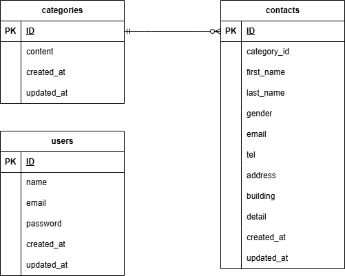

# お問い合わせフォーム

お問い合わせ用のフォームです。

フォームに入力しデータを送信すると入力確認用ページが表示され、入力内容を確認し再度送信するとお問い合わせ完了ページが表示されます。<br>
管理画面では、お問い合わせの内容の一覧を確認でき、名前や性別などで検索することが可能です。
お問い合わせの詳細をモーダル表示で確認でき、データ削除も可能です。<br>
認証機能を実装しており、ログインすることで管理画面を確認できます。

## 環境構築

#### リポジトリをクローン

```
git clone git@github.com:ikemi-yuki/test-contact-form.git
```

#### Laravelのビルド

```
docker-compose up -d --build
```

#### Laravelパッケージのダウンロード

```
docker-compose exec php bash
```

```
composer install
```

#### .envファイルの作成

```
cp .env.example .env
```

#### .envファイルの修正

```
DB_HOST=mysql

DB_DATABASE=laravel_db

DB_USERNAME=laravel_user

DB_PASSWORD=laravel_pass
```

#### キー生成

```
php artisan key:generate
```

#### マイグレーション・シーディングを実行

```
php artisan migrate
```

```
php artisan db:seed
```

## 使用技術（実行環境）

フレームワーク: Laravel:8.83.29

言語： HTML CSS PHP

Webサーバー: Nginx:1.21.1

データベース: MySQL:8.0.26

## ER図



## URL

アプリケーション：http://localhost/

管理画面：http://localhost/admin/

phpMyAdmin：http://localhost:8080/